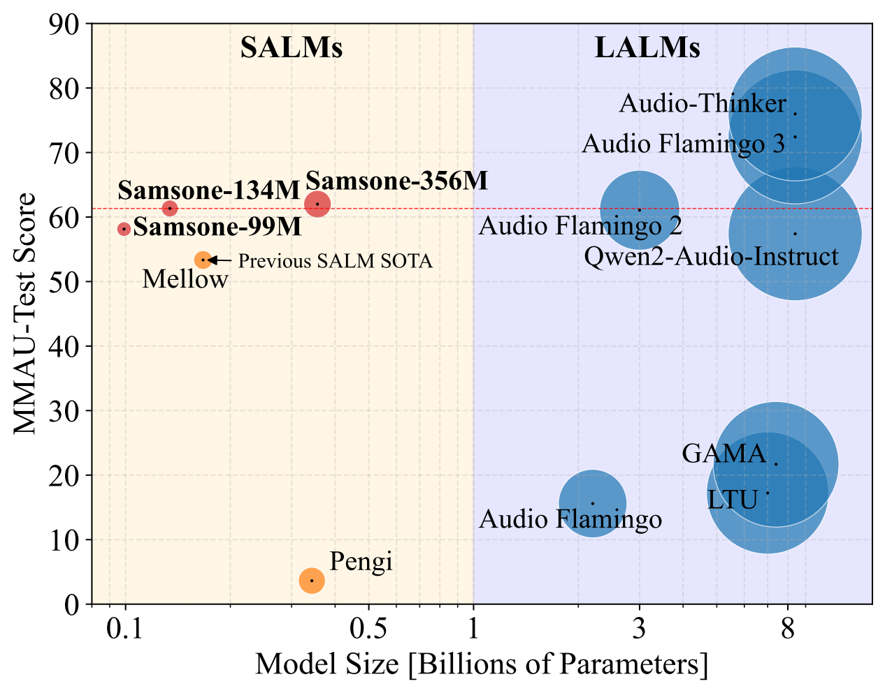
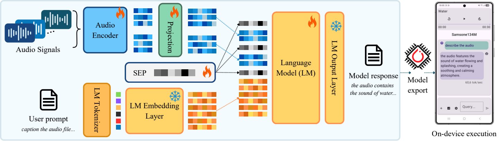

<p align="center">
  <a>
    
  </a>
</p>

<center>

  [Full Paper](https://github.com/SamsungLabs/samsone.git)

</center>

Official repo for _**Samsone: A Family of Open Small Audio Language Models for On-Device Inference**_
*Accepted at Interspeech 2026.*


<p align="center">
  <a href="assets/model_performance.pdf">
    
  </a>
</p>

Samsone is a family of open Small Audio Language Models (SALMs) for efficient audio understanding. The release includes
Samsone-99M, Samsone-134M, and Samsone-356M checkpoints for both on-device and server-side inference.

## Release

We release:

- Server-side PyTorch checkpoints for all three Samsone models.
- Mobile-optimized ExecuTorch checkpoints for the Android application.
- Training, evaluation, export, and Android application code.

The Python API automatically downloads a server-side checkpoint from the GitHub
Release on first use and stores it in `~/.cache/samsone`.

## Python inference

Install the project with `uv`:

```commandline
uv sync
```

Then load a model directly:

```python
from samsone import Samsone134M

model = Samsone134M()
output = model(audio="path/to/audio.wav", prompt="Caption the audio")
print(output)
```

`audio` accepts either one path or a list of paths. A list represents multiple
clips for one prompt and returns one response.

```python
output = model(
    audio=["audio1.wav", "audio2.wav"],
    prompt="what is the difference between audio files?",
)
```

Available models are `Samsone99M`, `Samsone134M`, and `Samsone356M`. Pass
`checkpoint_path="/path/to/checkpoint.ckpt"` to use a local server checkpoint
instead of the release cache.

## Command-line inference

The package exposes one CLI command per model:

```commandline
uv run samsone134M --audio assets/cow.wav assets/water.wav --prompt "compare audio files"
```

Example response:

```text
the two audios differ in their acoustic properties: (1) low-frequency, low-pitched sounds with a slow attack and decay, characteristic of animal vocalizations, while (2) high-frequency, high-pitched sounds with a fast attack and decay, characteristic of water splashing and dripping.
```

```commandline
uv run samsone356M --audio assets/water.wav --prompt "describe"
```

Example response:

```text
the sound is characterized by a steady, rhythmic patter of raindrops hitting the ground, with varying intensities and frequencies.
```

## Android application

The repository includes an open-source Android application for real-time,
on-device Samsone inference using the released mobile checkpoints.

1. Download the mobile `.pte` checkpoints from the GitHub Release.
2. Initialize the Android submodule and deploy the checkpoints to a connected device:

   ```commandline
   git submodule update --init --recursive
   cd android
   ./gradlew pushModelsToDevice
   ```

3. Open the `android` directory in Android Studio, connect an Android device
   (API 31 or later), and run the app.

See the [Android README](android/README.md) for model-export and deployment
details.

## System overview

<p align="center">
  <a href="assets/samsone_system_overview.pdf">
    
  </a>
</p>

## MMAU and MMAU-Pro results

Comparison of Audio Language Model performance on MMAU and MMAU-Pro.

### Small Audio Language Models

| Name | Size | Sound<br>mini | Sound<br>test | Music<br>mini | Music<br>test | Speech<br>mini | Speech<br>test | Avg.<br>mini | Avg.<br>test | MMAU-Pro |
|---|---:|---:|---:|---:|---:|---:|---:|---:|---:|---:|
| Pengi | 323M | 3.00 | 3.87 | 0.29 | 2.27 | 3.30 | 4.77 | 2.20 | 3.63 | 28.61 |
| Mellow | 167M | 69.37 | 66.17 | 56.89 | 58.13 | 30.63 | 35.73 | 52.30 | 53.34 | 27.50 |
| **Samsone-99M (ours)** | 99M | 72.97 | 71.13 | 60.78 | 61.17 | 37.84 | 42.10 | 57.20 | 58.13 | 36.83 |
| **Samsone-134M (ours)** | 134M | **76.28** | **73.23** | **66.47** | **62.87** | **46.25** | **47.90** | **63.00** | **61.33** | **37.57** |
| **Samsone-356M (ours)** | 356M | 75.98 | 74.27 | 70.34 | 65.83 | 44.74 | 45.90 | 63.70 | 62.00 | 40.67 |

### Large Audio Language Models

| Name | Size | Sound<br>mini | Sound<br>test | Music<br>mini | Music<br>test | Speech<br>mini | Speech<br>test | Avg.<br>mini | Avg.<br>test | MMAU-Pro |
|---|---:|---:|---:|---:|---:|---:|---:|---:|---:|---:|
| LTU | 7B | 20.42 | 20.67 | 15.97 | 15.68 | 15.92 | 15.33 | 17.44 | 17.23 | 33.46 |
| GAMA | 7.4B | 31.83 | 30.73 | 17.71 | 17.33 | 12.91 | 16.97 | 20.82 | 21.68 | 33.20 |
| SALMONN | 13B | 41.14 | 42.10 | 37.13 | 37.83 | 26.43 | 28.77 | 34.90 | 36.23 | 39.60 |
| Qwen2-Audio-Instruct | 8.4B | 67.27 | 61.17 | 56.29 | 55.67 | 55.26 | 55.37 | 59.60 | 57.40 | 45.41 |
| GPT-4o Audio | -- | 64.56 | 63.20 | 56.29 | 49.93 | 66.67 | 69.33 | 62.50 | 60.82 | **52.50** |
| Audio Flamingo 2 | 3B | 71.47 | 68.13 | 70.96 | 70.20 | 44.74 | 44.87 | 62.40 | 61.06 | 42.60 |
| Audio Flamingo 3 | 8.4B | **79.58** | **75.83** | **73.95** | **74.47** | **66.37** | **66.97** | **73.30** | **72.42** | 51.70 |

## Training

Training code is included for full reproducibility. Our models were trained on the [ReasonAQA](https://zenodo.org/records/15036628)
and [AudioSkills](https://huggingface.co/datasets/nvidia/AudioSkills) datasets.
To train the models, download the data from the respective sources and transform
it into our parquet format. Each row should follow this structure:

| `filepaths` | `prompt` | `response` | `id` |
|---|---|---|---|
| `["path/to/audio.wav"]` | `"caption audio"` | `"A person is singing."` | `"abcd-1234-efgh-5678"` |

Adjust dataset paths and other infrastructure-specific settings before launching a run.

Run a training job with:

```commandline
uv run scripts/run_train.py --config configs/Samsone99M.yaml
```

The release configurations are in [configs](configs/), including
[Samsone99M.yaml](configs/Samsone99M.yaml),
[Samsone134M.yaml](configs/Samsone134M.yaml), and
[Samsone356M.yaml](configs/Samsone356M.yaml).

## Citation

```bibtex
@inproceedings{masztalski2026samsone,
  title={Samsone: A Family of Open Small Audio Language Models for On-Device Inference},
  author={Masztalski, Piotr and Grzeszczyk, Michal K. and Sikorski, Olaf},
  booktitle={Interspeech 2026},
  year={2026}
}
```
